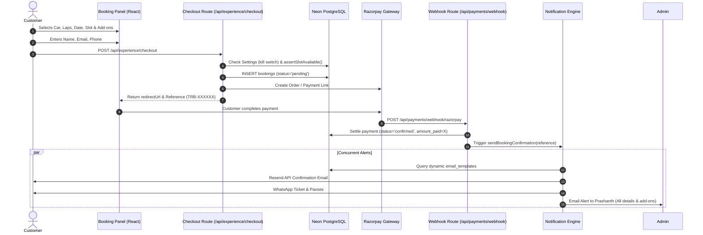

# TurboRide Booking Platform — Full Architecture & Backend Guide

> **Quick Reference**: This document serves as the single source of truth for the TurboRide booking engine, checkout pipeline, database schemas, schedule availability algorithm, admin control suite, and multi-channel notification systems. Whenever troubleshooting or building new features, refer to this document first.

---

## 1. High-Level System Overview

TurboRide (`book.turboridesupercars.com`) is a luxury supercar experience booking platform providing high-performance track driving sessions, passenger ride-alongs, media add-ons, and dynamic slot scheduling.

### Technology Stack
- **Framework**: Next.js 16 (App Router, Turbopack, React 19, Server Actions)
- **Styling**: Tailwind CSS + Radix UI + Lucide Icons + Glassmorphism aesthetic
- **Database**: Neon Serverless PostgreSQL (`pg` connection pool with SSL)
- **Payments**: Razorpay (`razorpayCreatePayment` / Webhooks) & PhonePe fallback
- **Email Delivery**: Resend API (`resend` SDK / SMTP gateway) with custom domain
- **WhatsApp Concierge**: Meta WhatsApp Cloud API (automated ticket passes, drips, live chat webhook)
- **Hosting & CI/CD**: Vercel Production (`turborideclub` GitHub organization)

---

## 2. Directory & File Map (Quick-Finder Index)

Location: `turboride-booking-app/`

| Domain | File Path | Purpose & Context |
| :--- | :--- | :--- |
| **Experience Booking UI** | `components/experience/booking-panel.tsx` | Main interactive booking widget with car selector, laps, add-ons, and totalizer |
| **Slot Picker** | `components/experience/slot-selection.tsx` | Calendar date picker and available time slot selector with live seat badges |
| **Mobile Sticky Bar** | `components/experience/mobile-booking-bar.tsx` | Mobile persistent CTA bar (docked above WhatsApp floating button) |
| **Checkout API** | `app/api/experience/checkout/route.ts` | Primary API endpoint handling booking reservation creation and gateway order generation |
| **Server Actions (Booking)**| `app/actions/booking.ts` | Server actions for `createBooking`, `settleBookingPayment`, `rescheduleBooking`, `getContactPrefill` |
| **Pricing Engine** | `lib/turboride/pricing.ts` | Base lap calculations, multi-car lineup summation, add-ons pricing, and tax/discount breakdown |
| **Schedule Engine** | `lib/turboride/schedule.ts` | Slot capacity logic, blackout date filtering, and active booked seat counts |
| **Database Pool** | `lib/db.ts` | PostgreSQL connection pool (`pg.Pool`) connected to Neon DB |
| **Admin Bookings Table** | `components/admin/bookings-table.tsx` | Admin management table, status tabs, search, and booking details drawer |
| **Admin Bookings Data** | `lib/turboride/admin-bookings.ts` | Data mapping and server action `fetchAdminBookingsAction`, add-ons parser |
| **Customer Emails** | `lib/turboride/email/booking-emails.ts` | Dynamic customer confirmation and reschedule email dispatch using DB templates |
| **Admin Alerts** | `lib/turboride/notifications/admin-alerts.ts` | Instant email notifications sent to Prashanth / Marketing on new bookings or reschedules |
| **WhatsApp Service** | `lib/turboride/whatsapp/booking.ts` | WhatsApp confirmation ticket generation and Meta Cloud API integration |
| **Payment Webhooks** | `app/api/payments/webhook/[gateway]/route.ts` | Authoritative payment status webhook receiver (Razorpay, PhonePe) |
| **Admin Emails Manager** | `app/admin/emails/page.tsx` | Admin UI for viewing and editing live email template contents |
| **Global Settings** | `lib/turboride/settings.ts` | Centralized site settings (kill switch, pricing toggles, lap options) |

---

## 3. Core Database Schemas & Data Models

### 3.1 `bookings` Table (Primary Ledger)
The single source of truth for customer reservations.

```sql
CREATE TABLE bookings (
  id VARCHAR(64) PRIMARY KEY,              -- Reference code, e.g. "TRB-8F4K2A"
  car_id VARCHAR(64) NOT NULL,             -- Primary car ID (e.g. 'porsche-718')
  car_name VARCHAR(128) NOT NULL,           -- Display name (e.g. 'Porsche 718 Cayman')
  laps INTEGER NOT NULL DEFAULT 1,          -- Number of driving laps
  cars JSONB,                              -- Multi-car lineup: Array of { carId, carName, laps, rideAlongLaps, pricePerLap }
  addons JSONB,                            -- Add-ons metadata: { extended: boolean, photoshoot: boolean, reels: number }
  addons_price NUMERIC DEFAULT 0,          -- Total price charged for add-ons (₹)
  base_price NUMERIC DEFAULT 0,            -- Base drive cost excluding add-ons (₹)
  discount NUMERIC DEFAULT 0,              -- Voucher or full-pay online discount (₹)
  tax NUMERIC DEFAULT 0,                   -- GST (18%) if applicable (₹)
  total NUMERIC NOT NULL,                  -- Final gross total (₹)
  amount_paid NUMERIC NOT NULL DEFAULT 0,  -- Amount collected online (₹)
  status VARCHAR(32) NOT NULL DEFAULT 'pending', -- 'pending' | 'confirmed' | 'scheduled' | 'redeemed' | 'cancelled'
  is_prebook BOOLEAN DEFAULT FALSE,        -- True if booking without choosing fixed date/slot upfront
  experience_date DATE,                    -- Scheduled drive date (YYYY-MM-DD)
  time_slot VARCHAR(64),                   -- Scheduled time slot (e.g. '07:00 AM - 08:00 AM')
  customer_name VARCHAR(128),
  customer_email VARCHAR(128),
  customer_phone VARCHAR(32),
  payment_gateway VARCHAR(32),             -- 'razorpay' | 'phonepe' | 'cashfree' | 'venue'
  payment_id VARCHAR(128),                 -- Gateway order/payment ID
  voucher_code VARCHAR(64),                -- Coupon or gift card code applied
  voucher_discount NUMERIC DEFAULT 0,
  reschedule_count INTEGER DEFAULT 0,      -- Number of times rescheduled by customer
  reschedule_fees_paid NUMERIC DEFAULT 0,  -- Cumulative fees collected for moves
  paid_in_full_at TIMESTAMPTZ,
  created_at TIMESTAMPTZ DEFAULT NOW(),
  updated_at TIMESTAMPTZ DEFAULT NOW()
);
```

#### Add-ons Data Specification in PostgreSQL
Add-ons are stored across two complementary fields:
1. `bookings.addons` (JSONB):
   ```json
   {
     "extended": true,
     "photoshoot": false,
     "reels": 0
   }
   ```
2. `bookings.cars` (JSONB Array):
   ```json
   [
     {
       "carId": "porsche-718",
       "carName": "Porsche 718 Cayman",
       "laps": 1,
       "rideAlongLaps": 1,
       "pricePerLap": 10000
     }
   ]
   ```
3. `bookings.addons_price` (NUMERIC):
   - `6000` = Extended Highway Drive (Co-passenger)
   - `3000` = Professional Video Session (4K Reel)
   - `9000` = Both Add-ons Selected
   - Fallback parser in `admin-bookings.ts` and `admin-alerts.ts` inspects all three fields to guarantee 100% display accuracy.

---

### 3.2 `slot_settings` Table
Controls capacity and operating schedule per slot.
- `slot`: Time slot string (e.g. `'07:00 AM - 08:00 AM'`)
- `capacity`: Maximum cars/drivers permitted concurrently (Default: 2)
- `is_active`: Boolean toggle
- `sort_order`: Display sorting priority

### 3.3 `blackout_dates` Table
Defines track maintenance, private track days, or holidays.
- `id`: UUID / identifier
- `start_date`: Start of blocked range (`DATE`)
- `end_date`: End of blocked range (`DATE`)
- `reason`: Explanation string (e.g. "Monsoon Track Resurfacing")

### 3.4 `email_templates` Table
Enables dynamic editing of customer notification templates from `/admin/emails`.
- `key`: Unique template slug (e.g. `'booking_confirmation'`, `'payment_receipt'`)
- `name`: Display name in admin
- `subject`: Email subject with `{reference}`, `{car}`, `{date}` variables
- `body`: Plain text / HTML content with dynamic placeholder replacement
- `enabled`: Toggle switch

### 3.5 `vouchers` Table
Handles promotional coupons, influencer discounts, and prepaid gift cards.
- `code`: Uppercase voucher string (e.g. `'SPEED10'`, `'VIP5000'`)
- `discount_kind`: `'percentage'` or `'fixed'`
- `discount_value`: Value of discount
- `single_use`: Boolean (redeemed once and marked inactive)
- `status`: `'active'`, `'redeemed'`, `'expired'`

---

## 4. End-to-End Booking & Checkout Lifecycle



### Step 1: User Selection & Slot Checking
- Customer selects car, date, slot, and optional add-ons (`Extended Drive` ₹6,000, `Video Session` ₹3,000).
- Frontend queries available slots. Unavailable slots (sold out or blacked out) are disabled in the UI.

### Step 2: Checkout Request (`/api/experience/checkout`)
- **Server-Side Validation**:
  - Global kill switch check (`settings.bookingsPaused`).
  - Contact validation (valid email, 10-digit mobile number, full name).
  - Strict schedule availability re-check (`assertSlotAvailable(date, slot)`).
- **Pricing Calculation**:
  - Base price = `pricePerLap * participants`.
  - Add-ons price = `photoshootCost + extendedCost`.
  - Voucher discount deducted if coupon applied.
- **Atomic Reservation**:
  - Transaction opens in PostgreSQL.
  - Inserts booking with `status = 'pending'`.
  - Single-use voucher is flagged.
  - Transaction commits.

### Step 3: Gateway Order Creation
- Generates payment order via Razorpay / PhonePe.
- Returns `{ ok: true, reference, redirectUrl }`.
- Customer is redirected to the secure gateway checkout page.

### Step 4: Authoritative Settlement (`settleBookingPayment`)
- Once paid, payment completes via browser callback `/book/callback` OR payment webhook `/api/payments/webhook/[gateway]`.
- Webhook does not blindly trust incoming payloads; it calls `verifyGatewayPayment()` to verify directly with the gateway status API.
- Atomically updates `status = 'confirmed'`, sets `amount_paid`, and records `paid_in_full_at`.
- Using `WHERE id = $1 AND status = 'pending'`, only the exact process that flips the row fires the notification pipeline, eliminating duplicate emails.

### Step 5: Instant Multi-Channel Notifications
- **Customer Email**: Dispatched using Resend, rendering the customizable template from `email_templates` (`key = 'booking_confirmation'`).
- **Customer WhatsApp**: Formatted WhatsApp message with reference badge, drive instructions, and live location pin.
- **Admin Email Alert**: Dispatched to `ADMIN_EMAIL` (`prashanth...` / `turboridemarketing@gmail.com`) containing:
  - Reference and Customer Name/Phone with direct WhatsApp chat link.
  - Quick Highlights: Car, Scheduled Date, Time Slot, and **Selected Add-ons**.
  - Customer Information table.
  - Financial Summary breakdown showing Base Drive Price, **Add-ons itemized**, Amount Paid Online, and Balance Due.

---

## 5. Reschedule Engine & Business Logic

Customers can reschedule upcoming track drives from `/account` or `/book/confirmation/[reference]`.

### Business Rules
1. **Complimentary 1st Move**: The first reschedule is free of cost (`rescheduleCount === 0`).
2. **Subsequent Reschedules**: Incur a fee of **₹1,500** (`rescheduleFeeFor(count)`).
3. **Availability Constraint**: The requested new date and time slot must have available capacity in `slot_settings` and not be blacked out.

### Reschedule Flow
1. Customer selects a new date and time slot.
2. If a fee is required, gateway checkout is initiated for ₹1,500.
3. Upon settlement, `rescheduleBooking()` executes:
   - Updates `experience_date = newDate`, `time_slot = newSlot`.
   - Increments `reschedule_count = reschedule_count + 1`.
   - Updates `reschedule_fees_paid += fee`.
4. **Notifications Dispatched**:
   - Customer receives the updated schedule confirmation email rendered from the `booking_confirmation` template.
   - Admin receives `sendAdminRescheduleAlert` highlighting Old Slot vs. New Slot, move number, fee paid, customer contact details, and add-ons.

---

## 6. Admin Control Suite (`/admin`)

The Admin suite is protected by session authentication with secure password hashing.

### Admin Sections
1. **Bookings (`/admin/bookings`)**:
   - Filter by status tabs: `All`, `Active`, `Confirmed`, `Redeemed`, `Cancelled`.
   - Search by customer name, phone, email, or reference code.
   - Live **Add-ons chips** displayed in the table.
   - Slide-out **Booking Details Drawer**:
     - Customer phone with 1-click WhatsApp web chat button.
     - Scheduled drive details.
     - Add-ons listed by name (e.g. `Extended Drive · Professional Video Session`).
     - Itemized Financial Breakdown: Drive Base, `Add-ons (1)`, Voucher Discount, Paid Online, Balance at Venue.
     - Status changer: Mark as `Redeemed`, `Confirmed`, `Cancelled`. Note: Marking as `Redeemed` preserves the record in the database and updates status tabs appropriately without dropping rows.
2. **Schedule (`/admin/schedule`)**:
   - Manage slot capacities, activate/deactivate time slots, and add blackout date ranges.
3. **Fleet (`/admin/fleet`)**:
   - Add/edit supercars, update per-lap pricing, ride-along pricing, and availability status.
4. **Emails (`/admin/emails`)**:
   - Live editor for email templates and subject lines with dynamic variable reference tags.
5. **Settings (`/admin/settings`)**:
   - Master kill switch (`bookingsPaused`), default discount rates, GST toggles, and base add-on prices.
6. **WhatsApp (`/admin/whatsapp`)**:
   - View broadcast stats, automated drip status, and template compliance.

---

## 7. Developer & Production Safeguards

### 1. Database Preservation Rule
> **STRICT DIRECTIVE**: Never drop tables or delete production booking records in the Neon PostgreSQL database. All testing or cancellations must operate via status updates (`status = 'cancelled'`).

### 2. Vercel Hobby Plan Author Constraint
> **CRITICAL**: Commits pushed to GitHub triggers Vercel CI. If a commit author is not recognized as a member of the Vercel team, the build will be blocked with:
> `Error: The commit author is not a member of the team on the Hobby plan.`
>
> **Always commit with the project owner identity**:
> ```bash
> git commit --author="turborideclub <310921698+turborideclub@users.noreply.github.com>" -m "..."
> ```

### 3. Environment Variables Sync
Production environment variables are maintained in `.env.production` and synced to Vercel:
- `DATABASE_URL`: Neon PostgreSQL connection string with `sslmode=require`
- `ADMIN_EMAIL`: Destination email for admin alerts (e.g. `prashanth...`)
- `RESEND_API_KEY`: API key for email delivery
- `RAZORPAY_KEY_ID` & `RAZORPAY_KEY_SECRET`: Live payment credentials
- `WHATSAPP_ACCESS_TOKEN` & `WHATSAPP_PHONE_NUMBER_ID`: Meta Cloud API credentials
- `ADMIN_PASSWORD_HASH`: Scrypt/bcrypt hash for admin panel login
